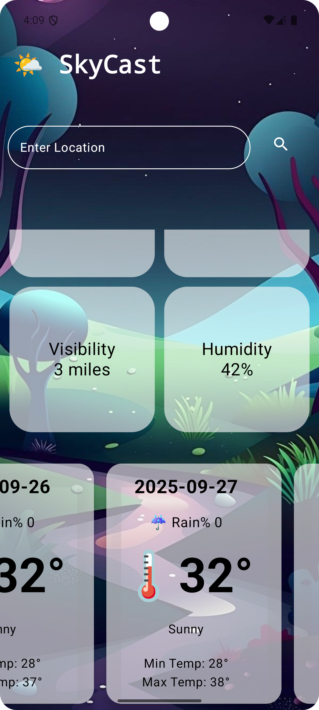

# 🌤️ SkyCast Weather App

SkyCast is an Android weather application that provides real-time weather updates for any city.  
It is built using **Kotlin** and integrates with a **Weather API** for fetching live data.

---

## 🚀 Features
- 🌍 Search weather by city
- 📍 Get current location weather (with permission)
- 🌡️ Temperature, humidity, and pressure details
- 🌦️ Weather conditions with icons
- 🔔 Error handling for invalid cities
- ⚡ Fast and lightweight app

---

## 🛠️ Tech Stack
- **Language:** Kotlin  
- **Framework:** Android SDK, Jetpack Components  
- **API:** WeatherApi using Retrofit library

---

## 📸 Screenshots

  
  
  
  

